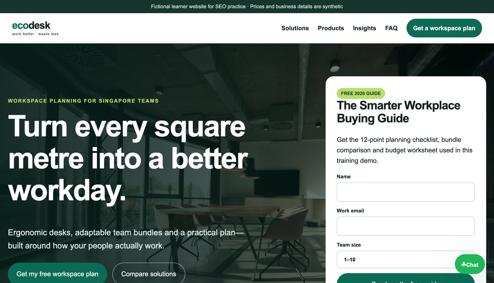

<div align="center">

# Generative AI for SEO

[](https://www.tertiarycourses.com.sg/generative-ai-for-seo.html)


**A one-day, hands-on course for using generative AI responsibly across SEO strategy, keyword research, content, on-page optimisation, AI search visibility, off-page distribution and measurement.**

[Register for the course](https://www.tertiarycourses.com.sg/generative-ai-for-seo.html) · [Open the live EcoDesk website](https://tertiarycourses.github.io/C11-Generative-AI-for-SEO/) · [Open the activity index](labs/README.md)

</div>


## About this repository

This learner-facing repository contains version 2.0 of the courseware for **C11**. It covers current, source-grounded practice for generative AI, Google AI Overviews and AI Mode, multimodal content, prompt controls, responsible agentic workflows, and Search Console/GA4 measurement.

The fictional **EcoDesk Singapore** website is the progressive case environment. All ten activities use and optimise [one shared live website](https://tertiarycourses.github.io/C11-Generative-AI-for-SEO/) with a strong commercial pitch, lead magnet, enquiry funnel, product and article pages, structured data, and a WhatsApp-style assistant. Each activity keeps its own prompts, tips, sample data, sample article and evidence checklist.

## Live EcoDesk demo

[](https://tertiarycourses.github.io/C11-Generative-AI-for-SEO/)

**Live URL:** https://tertiarycourses.github.io/C11-Generative-AI-for-SEO/

## Courseware

| Artifact | Purpose |
|---|---|
| [Course slides](courseware/Generative%20AI%20for%20SEO-v2.0.pdf) | Highly visual, concept-led 143-slide deck; procedures are intentionally kept out of the slides |
| [Learner Guide](courseware/LG-Generative%20AI%20for%20SEO.pdf) | Detailed concepts, scenarios, step-by-step lab procedures, checks and acceptance criteria |
| [Lesson Plan](courseware/LP-Generative%20AI%20for%20SEO.pdf) | One-day delivery schedule (9:30am–5:30pm) and slide/lab mapping |
| [Shared EcoDesk website](labs/ecodesk-demo-website/) | One progressive HTML/CSS/JavaScript site for all ten activities |
| [Activity index](labs/README.md) | Entry point to the ten individual prompt-and-evidence packs |

Editable PPTX and DOCX files are available in [`courseware/`](courseware/).

## Progressive labs

| Lab | Applied outcome |
|---:|---|
| [1 — Audit the EcoDesk demo website](labs/lab-01-audit-the-ecodesk-demo-website/) | Establish a technical, content, authority and measurement baseline |
| [2 — Design the SIGNAL AI SEO strategy](labs/lab-02-design-the-signal-ai-seo-strategy/) | Build a governed AI SEO roadmap and prompt policy |
| [3 — Generate and validate a keyword universe](labs/lab-03-generate-and-validate-a-keyword-universe/) | Expand, classify and validate keywords without inventing metrics |
| [4 — Cluster keywords and build briefs](labs/lab-04-cluster-keywords-and-build-content-briefs/) | Map intent, prevent cannibalisation and create grounded briefs |
| [5 — Create a people-first SEO article](labs/lab-05-create-a-people-first-seo-blog-article/) | Draft, verify and edit an answer-first article using a claim ledger |
| [6 — Generate image, video and LinkedIn assets](labs/lab-06-generate-image-video-and-linkedin-assets/) | Create accessible multimodal prompts and an earned-link social post |
| [7 — Generate and implement on-page SEO meta](labs/lab-07-generate-and-implement-on-page-seo-meta/) | Implement accurate metadata, internal links and JSON-LD |
| [8 — Optimise for Google AI Overviews](labs/lab-08-optimise-an-answer-page-for-google-ai-overviews/) | Build an eligible, answer-first page without unsupported GEO hacks |
| [9 — Analyse Search Console and GA4 data](labs/lab-09-analyse-search-console-and-ga4-data-with-ai/) | Use AI to diagnose evidence while avoiding attribution traps |
| [10 — Build a governed agentic SEO workflow](labs/lab-10-build-a-governed-agentic-seo-workflow/) | Specify tools, approvals, logs, limits and rollback |

## Run the shared website

No build system or dependency installation is required.

```bash
python3 -m http.server 8000 --directory activities/ecodesk-demo-website
```

Open `http://localhost:8000/`. Keep the current activity's `README.md`, `prompt-pack.md`, `seo-tips.md`, `sample-data.csv` and `evidence-checklist.md` as the working pack while applying changes to this same shared site. PDF equivalents are included for offline use.

## Field-tested prompt templates

Labs 3–10 ship eight copy-paste prompt templates — four for SEO meta titles and descriptions (single page, bulk section, high-impression/low-CTR rescue, Singapore local intent) and four for LinkedIn posts (article repurposing, first-person experience, course/event announcement, one-article-five-posts). They are published in [AI Prompts for SEO Meta Tags & LinkedIn Posts](https://www.tertiarycourses.com.sg/blog/ai-prompts-seo-meta-linkedin-posts) and reproduced in each lab's `prompt-pack.md` alongside the five-part prompt skeleton (role, context, constraints, format, guardrail), a "what to check" review note and a 60-second pre-publish checklist. The templates are model-agnostic — the same wording works in ChatGPT, Claude, Gemini and Copilot.

## Learning architecture

```text
Legacy v13 foundations + current evidence
                    |
      5 outcomes / K1-K10 / A1-A6
                    |
  visual deck -> detailed Learner Guide
                    |
      10 progressive EcoDesk labs
                    |
     evidence -> review -> acceptance test
                    |
    WA + Practical Performance assessment
```

## Responsible-use boundary

- Treat AI as a copilot or bounded workflow, not an unquestioned publisher.
- Ground prompts in approved facts and real measurement data; use `unknown` when a metric is missing.
- Check privacy, copyright, accessibility, brand and factual accuracy before publication.
- Avoid keyword stuffing, scaled low-value pages, link schemes, fake endorsements and guaranteed ranking or AI-citation claims.
- Google does not require special AI-only markup or an `llms.txt` file for its generative search features; foundational SEO and useful, indexable content remain the base.

## Developed by

Tertiary Infotech Academy Pte Ltd · UEN 201200696W

Course registration: [Generative AI for SEO](https://www.tertiarycourses.com.sg/generative-ai-for-seo.html)
